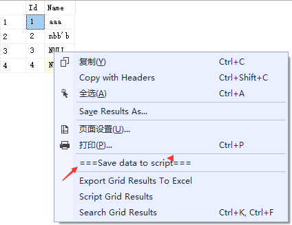
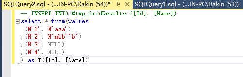

# SSMS.SpaceX
ssms addin learning

# how to install
unzip to D:\Program Files\SSMS.SpaceX

in SSMS Extensions folder, mk dir name SpaceX. copy below files to it
extension.vsixmanifest
VSIXProject.SSMS.SpaceX.pkgdef (need change "CodeBase" as your fact path)

ssms 2014 C:\Program Files (x86)\Microsoft SQL Server\120\Tools\Binn\ManagementStudio\Extensions
ssms 2016 C:\Program Files (x86)\Microsoft SQL Server\130\Tools\Binn\ManagementStudio\Extensions
# how to use
 in query result, right click grid result. choose menu [save data to script].
 

